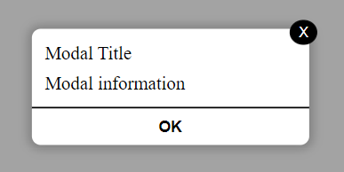

# Modal - React Component


## General information

An user-friendly, lightweight and customisable pop up which display your message in a modal

## Install

To install, you can use [npm](https://npmjs.org/) or [yarn](https://yarnpkg.com):

    $ npm install --save info-modal-component
    $ yarn add info-modal-component

## Usage

You can use it like a simple React component in your React project

```javascript
import { InfoModal } from 'info-modal-component'

const [isModalOpen, setIsModalOpen] = useState(false)

{
  isModalOpen ? (
    <InfoModal
      setIsModalOpen={setIsModalOpen}
      // Set your Props here //
    />
  ) : null
}
```

## Props

- `title` : {string} title of your modal (i.e 'Helo world')
- `information`: {string} message of your modal (i.e 'Welcome')
- `modalBg`: {string} colour value of your modal's background (i.e '#ffffff')
- `TitleTextAlign`: {string} position of your text (i.e 'left' or 'center' or 'right')
- `TitleTextColor`: {string} colour value of your modal's title (i.e ' #0000FF')
- `InformationTextAlign`: {string} position of your text (i.e 'left' or 'center' or 'right')
- `InformationTextColor`: {string} colour value of your modal's message (i.e ' #0000FF')
- `ValidationBtnBgColor`: {string} colour value of your modal's validation button background (i.e ' #ffffff')
- `ValidationBtnColor`: {string} colour value of your modal's validation button (i.e ' #0000FF')

## Exemple

```javascript
function App() {
  const [isModalOpen, setIsModalOpen] = useState(false)

  const handleOpenModalClick = () => {
    setIsModalOpen(true)
  }

  return (
    <main
      style={{
        width: '100vw',
        height: '100vh',
        position: 'absolute',
        zIndex: '5',
        top: '50%',
        left: '50%',
        background: 'rgba(0, 0, 0, 0.2)',
        transform: 'translate(-50%, -50%)',
      }}
    >
      <button
        style={{
          width: 200,
          height: 100,
          padding: 5,
          position: 'fixed',
          top: '50%',
          left: '50%',
          transform: 'translate(-50%, -50%)',
          borderRadius: 25,
          fontSize: 20,
          background: 'rgba(255, 246, 235, 1)',
        }}
        onClick={() => {
          handleOpenModalClick()
        }}
      >
        Open Modal
      </button>
      {isModalOpen ? (
        <InfoModal
          setIsModalOpen={setIsModalOpen}
          /// Props ///
          title={'Hello World'}
          information={'Welcome !!!'}
          modalBg={
            'radial-gradient(circle, rgba(255, 246, 235, 1) 0%, rgba(255, 228, 196, 1) 70%)'
          }
          TitleTextAlign={'center'}
          TitleTextColor={'#00bc77'}
          InformationTextAlign={'center'}
          InformationTextColor={'#257b5a'}
          ValidationBtnBgColor={'transparent'}
          ValidationBtnColor={'#257b5a'}
        />
      ) : null}
    </main>
  )
}

export default App
```

## Screenshot

### Custom

  
  
### Default



## License

License MIT
